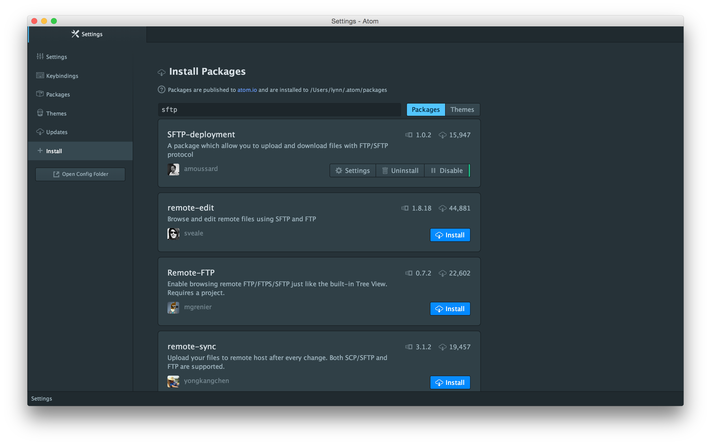

# Atom-SFTP
A guide to connect atom.io to Umich's CAEN computers.

This is a guide to set up atom/SFTP and how to connect it to UMich's CAEN computers. It will also show you how to ssh into CAEN by terminal and compile there. So you won't need to use the VNC at all. This is how I do it in OS X and it should also work for GNU\\Linux systems. *Sorry Windows users...*


## Background (skip this if you just want to get started)
After just starting EECS 280 I saw on piazza how to set up SFTP with Sublime Text so that you don't need a type of virtual machine of a CAEN computer. Specifically [Rachel Xiang's guide](http://rdxiang.github.io/programming/sublime-sftp/). So she deserves a lot of credit for bringing this to my attention.

Since I don't have Sublime, but the FOSS equivalent - atom, I made this guide detailing the small differences of setting up SFTP on it. Atom is more enjoyable to work in than gedit on UMich's Linux computers (you should still get familiar with gedit though) and keeps things looking pretty while you build them.

**In short:** With this guide you should be able to write in atom build in a CAEN environment from the comfort of your own computer!

-------------
## Setup SFTP

#### 1. Get Atom!
Choose the correct download from [their website here](https://atom.io/) and install so you're set to go!

#### 2. Get SFTP-deployment

Atom comes built-in with a package manager, so you can download and install packages just by going in the settings by `Atom` -> `Preferences...` or `⌘,` or `command-,` and selecting `Install`. Then search for `sftp`. It should look something like this



You want to instal `SFTP-deployment`. Just click the install button and it's applied!

#### 3. Choose the folder with the contents you want to synchronize

If haven't already, open your project folder in atom. This is by `File` -> `Add Project Folder...` or `⇧⌘O` or `shift-command-O`. The folder and its contents should show up in the sidebar.

#### 4. Setup SFTP

Now that you're in the folder you want to sync, generate the configuration file with `⌘⇧P` (to open atom's search) and searching `mapToRemote`. Choose that and then select `SFTP`. Now a JSON file should be generated! It should be `deployment-config.json`. Change the file to look like this:

```
{
    "type": "sftp",
    "host": "login.engin.umich.edu",
    "username": "uniquename",
    "password": "umichPassword",
    "port": "22",
    "remotePath": "/path/to/project/folder",
    "uploadOnSave": true
}
```
With `uniquename` and `umichPassword` replaced with your own umich login credentials. The `remotePath` should be the path to the folder on the CAEN computer that you want your files synced and saved to. To note, the CAEN home directory path is `/home/uniquename/`. From there you can get to folders like `Documents`, `Downloads`, and the like. Save when you're satisfied.

There are some other settings that can be added and then modified, but you'll have to search and read up on those.

#### 5. Make sure it works!

Now right click on your folder in the sidebar in atom. There should be an option for `FTP\SFTP`. From there choose `Upload selection`. In the top right of the editor it should say `Upload success`.

---------------

## SSH to CAEN

This part is super simple. Just open your terminal and type `ssh uniquename@login.engin.umich.edu` you will then be prompted for your password. Then you're in.

Remember the bash commands `ls` to list the files of the directory you are in, `pwd` to show your current file path, and `cd` to change directory. You can also use `cat` to view the contents of a file.

Navigate to the folder you synced your files to and compile with `g++ yourFile.cpp -o blah` from there. You can run the program with `./blah` just like in your normal terminal.

Type `exit` at any time to cancel out of the ssh.

#You did it! Great job!
